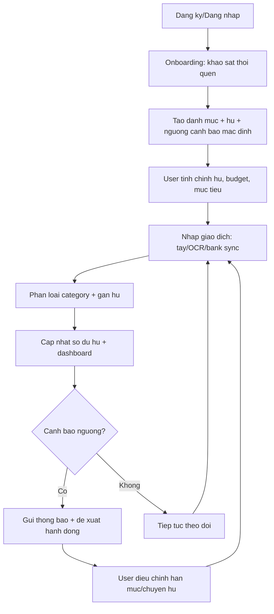
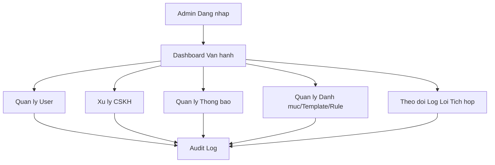

# Luồng nghiệp vụ tổng thể - Personal Finance App (Web)

## 1) Mục tiêu tài liệu

Tài liệu này mô tả luồng nghiệp vụ hoàn chỉnh cho hệ thống quản lý tài chính cá nhân theo mô hình nhiều hũ chi tiêu, phục vụ 2 actor chính là **User** và **Admin**.

Mục tiêu:

- Chuẩn hóa các flow để BE/FE cùng implement.
- Chốt phạm vi MVP trong 1 tháng.
- Làm rõ các tình huống lỗi, cảnh báo, và rollback dữ liệu.

---

## 2) Phạm vi & giả định triển khai MVP

### 2.1 Quyết định nghiệp vụ cho MVP (15/4-15/5)

| Câu hỏi                              | Quyết định MVP                                                                                   |
| ------------------------------------ | ------------------------------------------------------------------------------------------------ |
| Có bao nhiêu actor chính?            | 2 actor: User, Admin                                                                             |
| Nền tảng?                            | Web app (React + Vite)                                                                           |
| App có giữ tiền của user không?      | **Không giữ tiền trực tiếp** trong MVP; app theo dõi sổ cái chi tiêu và số dư khai báo/bank sync |
| Quản lý tài chính phạm vi nào?       | Trọng tâm Chi tiêu + Tiết kiệm theo hũ; phần Đầu tư để phase sau                                 |
| Có kết nối giữa user với user không? | Có: ví chung/hũ chung qua cơ chế mời thành viên                                                  |
| Có tích hợp API bên ngoài không?     | Có: OCR hóa đơn, email/push notification, bank-link (nếu có provider phù hợp)                    |
| Có đưa lời khuyên chi tiêu không?    | Có: rule-based insights trong MVP                                                                |
| Có phân mục chi tiêu không?          | Có: danh mục mặc định + user tự tạo                                                              |
| Khả năng truy cập đồng thời          | Mức vừa (MVP), ưu tiên ổn định và nhất quán dữ liệu                                              |

### 2.2 Vì sao chọn mô hình "không giữ tiền" cho MVP

- Giảm rủi ro pháp lý và vận hành trong 1 tháng.
- Tập trung vào giá trị cốt lõi: phân hũ, cảnh báo sớm, tự động hóa nhập liệu, gợi ý chi tiêu.
- Dễ mở rộng sang mô hình giữ tiền ở phase sau nếu cần.

---

## 3) Actor và phạm vi quyền

### 3.1 User

User có thể:

- Đăng ký/đăng nhập, cập nhật hồ sơ.
- Khởi tạo cấu hình tài chính ban đầu (thu nhập, số dư, mục tiêu).
- Tạo/sửa/xóa hũ chi tiêu (jar), đặt hạn mức theo ngày/tháng, đặt ngưỡng cảnh báo.
- Ghi nhận giao dịch bằng tay, OCR hóa đơn, hoặc đồng bộ từ nguồn liên kết.
- Quản lý danh mục chi tiêu (mặc định + tùy chỉnh).
- Theo dõi dashboard: số dư, biểu đồ thu-chi, giao dịch gần đây, tiến độ mục tiêu.
- Tạo lịch nhắc thanh toán định kỳ (điện, nước, học phí...).
- Nhận cảnh báo sắp vượt ngân sách/vượt ngưỡng/sắp hết tiền.
- Mời bạn bè/người thân tham gia ví chung/hũ chung.
- Gửi feedback, chat CSKH.

### 3.2 Admin

Admin có thể:

- Quản lý user: xem, tìm kiếm, khóa/mở khóa.
- Tiếp nhận & xử lý ticket CSKH.
- Quản lý thông báo toàn hệ thống (broadcast).
- Theo dõi dashboard vận hành: user mới, số giao dịch, cảnh báo lỗi xử lý.
- Quản lý danh mục mặc định, template hũ, rule gợi ý cơ bản.

### 3.3 System (thành phần hỗ trợ)

Không phải actor chính nhưng tham gia luồng:

- OCR service (đọc hóa đơn).
- Notification service (email/push/in-app).
- Bank link provider (nếu bật).

---

## 4) Luồng nghiệp vụ tổng quát end-to-end (User)

## 4.1 Flow chính

1. User đăng ký/đăng nhập.
2. User thực hiện onboarding khảo sát thói quen chi tiêu.
3. Hệ thống tạo cấu hình mặc định:
   - Danh mục mặc định.
   - Bộ hũ gợi ý theo profile.
   - Ngưỡng cảnh báo ban đầu (ví dụ: 80% hạn mức hũ, hoặc tổng số dư khả dụng < 20%).
4. User xác nhận/chỉnh sửa hũ, ngân sách, mục tiêu.
5. User phát sinh giao dịch:
   - Nhập tay, hoặc
   - Chụp hóa đơn OCR, hoặc
   - Đồng bộ từ nguồn liên kết.
6. Hệ thống tự phân loại (category/jar) và yêu cầu user xác nhận nếu độ tin cậy thấp.
7. Hệ thống cập nhật số dư hũ, ngân sách, dashboard theo thời gian gần realtime.
8. Engine cảnh báo kiểm tra ngưỡng và gửi thông báo nếu gần/vượt mức.
9. Engine gợi ý đưa khuyến nghị tiết kiệm dựa trên hành vi gần đây.
10. User theo dõi tiến độ mục tiêu tài chính và điều chỉnh kế hoạch.

## 4.2 Sơ đồ flow chính

---

## 5) Luồng chi tiết theo phân hệ

### 5.1 Onboarding & thiết lập ban đầu

Input:

- Thu nhập ước tính/tháng.
- Mục tiêu ngắn hạn (tiết kiệm, kiểm soát chi tiêu).
- Nhóm ưu tiên chi tiêu.

Xử lý:

- Sinh bộ hũ mặc định (ăn uống, di chuyển, hóa đơn, tiết kiệm, phát sinh).
- Gợi ý tỷ lệ phân bổ theo profile.
- Tạo default alert rules.

Output:

- Bộ cấu hình tài chính ban đầu có thể chỉnh sửa ngay.

### 5.2 Quản lý hũ chi tiêu (Jar Management)

User có thể:

- Tạo hũ mới với tên, mục tiêu, hạn mức, ngày reset.
- Chuyển tiền giữa các hũ.
- Bật/tắt cảnh báo riêng cho từng hũ.

Ràng buộc:

- Không cho phép chuyển tiền vượt quá số dư khả dụng.
- Ghi audit log cho mọi thao tác chuyển hũ.

### 5.3 Nhập liệu giao dịch

Nguồn giao dịch:

- Manual input.
- OCR hóa đơn.
- Sync từ bank link (nếu có).

Logic xử lý:

- Chuẩn hóa dữ liệu giao dịch.
- Dedupe theo fingerprint (thời gian + số tiền + merchant + nguồn).
- Tự gợi ý category/jar dựa trên lịch sử.
- Nếu confidence thấp: bắt buộc user xác nhận trước khi ghi sổ.

### 5.4 Dashboard & báo cáo

Dashboard hiển thị:

- Tổng quan số dư theo hũ.
- Thu/chi theo ngày-tuần-tháng.
- Top danh mục đang vượt tốc độ chi.
- Giao dịch gần đây.
- Tiến độ mục tiêu tài chính.

### 5.5 Cảnh báo & nhắc việc

Loại cảnh báo:

- Cảnh báo mềm: đạt 80% hạn mức.
- Cảnh báo cứng: vượt 100% hạn mức.
- Cảnh báo số dư thấp: tổng số dư khả dụng < 20% ngưỡng an toàn.
- Cảnh báo đến hạn thanh toán định kỳ.

Kênh gửi:

- In-app (bắt buộc), email (tùy chọn), push (nếu có).

### 5.6 Gợi ý chi tiêu thông minh

MVP dùng luật đơn giản (rule-based), ví dụ:

- Nếu hũ ăn uống vượt 3 ngày liên tục: gợi ý giảm trần/ngày + đề xuất mức chi mới.
- Nếu hũ hóa đơn thường xuyên sát ngưỡng: tăng ngân sách hóa đơn và giảm hũ linh hoạt.
- Nếu tỷ lệ tiết kiệm < mục tiêu trong 2 tuần: gợi ý chuyển tự động phần dư cuối tuần vào hũ tiết kiệm (đề xuất, chưa auto thực thi tiền thật).

### 5.7 Ví chung / cộng tác

Flow:

1. Chủ ví tạo ví chung/hũ chung.
2. Gửi lời mời qua email/link.
3. Thành viên chấp nhận -> được cấp quyền theo vai trò (viewer/editor).
4. Mọi giao dịch đều ghi người thực hiện.
5. Hệ thống thông báo thay đổi quan trọng cho tất cả thành viên.

### 5.8 CSKH, feedback, chat

Flow:

1. User tạo ticket/feedback.
2. Hệ thống gán trạng thái: Open -> In Progress -> Resolved.
3. Admin phản hồi trong giao diện quản trị.
4. User đánh giá mức hài lòng sau khi đóng ticket.

---

## 6) Luồng nghiệp vụ Admin

1. Admin đăng nhập hệ thống quản trị.
2. Theo dõi dashboard vận hành.
3. Xử lý tác vụ theo nhóm:
   - User management (khóa/mở khóa).
   - Ticket CSKH.
   - Broadcast thông báo toàn hệ thống.
   - Quản lý danh mục mặc định/template/rule.
4. Xem log lỗi tích hợp (OCR, bank sync, notification).
5. Xuất báo cáo vận hành định kỳ.

---

## 7) Luồng ngoại lệ, rollback và quản trị rủi ro

### 7.1 Chuyển tiền giữa hũ thất bại

- Điều kiện: lỗi ghi DB/network timeout/xung đột dữ liệu.
- Xử lý:
  1.  Dùng transaction DB (ACID).
  2.  Nếu lỗi giữa chừng -> rollback về số dư cũ.
  3.  Tạo bản ghi lỗi + thông báo user thao tác thất bại.

### 7.2 User nhập số tiền vượt khả dụng

- Chặn ở tầng validation.
- Trả về message rõ nguyên nhân + gợi ý số tối đa có thể nhập.

### 7.3 Không gửi được cảnh báo

- In-app notification là kênh fallback bắt buộc.
- Queue retry cho email/push.
- Nếu retry quá ngưỡng -> ghi log cho admin theo dõi.

### 7.4 Mất đồng bộ đa thiết bị

- Áp dụng optimistic concurrency (version field).
- Khi conflict: ưu tiên bản ghi mới nhất + lưu lịch sử thay đổi để user đối soát.

### 7.5 Lỗi OCR hóa đơn

- Nếu OCR confidence thấp hoặc parse lỗi:
  - Hiển thị dữ liệu nháp.
  - Bắt buộc user xác nhận/chỉnh sửa trước khi lưu.

### 7.6 Trùng giao dịch

- Chạy dedupe trước khi tạo transaction chính thức.
- Nếu nghi ngờ trùng: chuyển trạng thái "Need confirm" thay vì tự động ghi nhận.

---

## 8) Mô hình dữ liệu cốt lõi (mức nghiệp vụ)

Entity chính đề xuất:

- User
- UserProfile
- FinancialAccount (manual/bank-linked)
- Jar
- Category
- Transaction
- BudgetLimit (ngày/tháng/theo category/theo jar)
- AlertRule
- Notification
- FinancialGoal
- SharedWallet
- SharedWalletMember
- SupportTicket
- AuditLog

Quan hệ quan trọng:

- User 1-N Jar
- Jar 1-N Transaction
- User 1-N BudgetLimit
- User 1-N AlertRule
- SharedWallet 1-N SharedWalletMember
- SupportTicket N-1 User

---

## 9) Nhóm API cần có để FE/BE tách việc

1. Auth APIs: register, login, refresh token, profile.
2. Onboarding APIs: khảo sát + tạo cấu hình mặc định.
3. Jar APIs: CRUD hũ, chuyển tiền hũ, lịch sử chuyển hũ.
4. Transaction APIs: create/update/delete/list, import OCR, import sync.
5. Category APIs: default + custom category.
6. Budget/Alert APIs: CRUD hạn mức + rule cảnh báo.
7. Dashboard/Report APIs: tổng quan, biểu đồ, top cảnh báo.
8. Goal APIs: CRUD mục tiêu + tiến độ.
9. Shared Wallet APIs: tạo ví chung, mời thành viên, phân quyền.
10. Support APIs: ticket/chat/feedback.
11. Admin APIs: user management, broadcast, operational metrics.

---

## 10) Mapping theo timeline triển khai

### 15/4 - 19/4

- Chốt API contract giả định cho FE/BE.
- Setup repo, auth skeleton, base entities.
- Dựng schema DB ban đầu + migration pipeline.

### 19/4 - 23/4

- Hoàn thiện entity chính + fix DB issues.
- Làm màn hình onboarding, jar setup, dashboard khung.

### 23/4 - 7/5

- Implement nghiệp vụ chính cho User/Admin:
  - CRUD giao dịch/hũ/category.
  - Budget + alert engine.
  - OCR import flow.
  - Support ticket + admin tools.

### 7/5 - 15/5

- Stabilize, test tích hợp, tối ưu hiệu năng.
- Soát rủi ro đồng bộ và retry notification.
- UAT và đóng gói deploy Docker.

---

## 11) Tiêu chí nghiệm thu MVP (Definition of Done)

- User tạo và quản lý nhiều hũ chi tiêu thành công.
- User nhập giao dịch qua manual và OCR, dữ liệu ghi nhận chính xác.
- Dashboard cập nhật gần realtime sau giao dịch.
- Cảnh báo hoạt động đúng theo ngưỡng đã cấu hình.
- Admin khóa/mở khóa user và xử lý ticket thành công.
- Các flow lỗi quan trọng có rollback hoặc thông báo rõ ràng.
- Chạy ổn định trên môi trường Docker với Postgres.

---

## 12) Mở rộng Phase 2 (nếu muốn app giữ tiền)

Khi mở rộng sang mô hình giữ tiền trực tiếp, cần bổ sung:

- Ví hệ thống và double-entry ledger.
- KYC/KYB, anti-fraud, hạn mức giao dịch.
- Cơ chế đối soát giao dịch ngân hàng theo ngày.
- Chính sách hoàn tiền, tra soát, dispute handling.

Khuyến nghị: chỉ triển khai sau khi MVP ổn định và có dữ liệu hành vi user thực tế.
